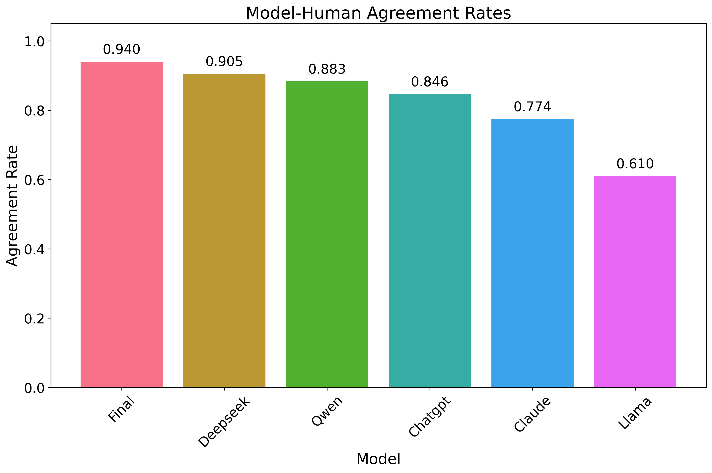

# UTN DLINT Hate-Speech Project: Lost in Translation? Hate Speech Evaluation across Languages, Models and Targets

<div style="font-family: charter;">
    Authors:
    <a href="https://github.com/billy0705" target="_blank">Ping-Lin Kuo</a>,
    <a href="https://github.com/dhsinjari" target="_blank">Dhimitri Sinjari</a>,
    <a href="https://github.com/OmarNabail" target="_blank">Omar Nabail</a>
</div>

## Introduction

This project studies how multilingual LLMs respond to hate speech prompts across four languages and six target groups. Using five different LLMs and 300 English samples translated into Arabic, Albanian, and Chinese from the CONAN dataset, we analyze safety performance, language effects, and target-specific behavior with validation from human annotators.

<div align="center">
  
</div>

## 📖 Outline
- [📂 Repository Structure](#repository-structure)
- [⚙️ Environment Setup](#environment-setup)
- [🗂️ Datasets](#datasets)
- [🤖 Models We Evaluated](#model-we-evaluated)
- [🎮 Evaluation](#evaluation)
- [📊 Evaluation Result](#evaluation-result)

## Repository Structure

*   `main.py`: The main script for running experiments (gathering responses and annotating).
*   `annotation.py`: Script for human annotation of the data.
*   `plot_generator.py`: Generates all the plots from the analysis.
*   `src/`: Contains the source code for data handling, models, and analysis.
*   `dataset/`: Contains the datasets used in the project.
*   `plots/`: Contains the generated plots and figures.
*   `requirements.txt`: Lists the Python dependencies.

## Environment Setup

1.  Setup the Virtual Enviroment for Python:
    ```bash
    python3 -m venv .venv
    source .venv/bin/activate
    ```

2.  Install the required Python packages:
    ```bash
    pip install -r requirements.txt
    ```

3.  Create a `.env` file in the root directory to store your API keys. For example:
    ```bash
    OPENAI_API_KEY="your_openai_api_key"
    DEEPSEEK_API_KEY="your_deepseek_api_key"
    ANTHROPIC_API_KEY="your_anthropic_api_key"
    ```

## Datasets

In this work we are using the [CONAN Dataset](https://github.com/marcoguerini/CONAN), sampling 300 English instances and translating them into Albanian, Arabic, and Chinese. The data is evenly distributed across six target groups: Jews, LGBT+, Migrants, People of Colour (POC), Women, and Other. This setup ensures balanced coverage across both languages and hate categories.
The full dataset and the translated samples can be found in the repository under dataset/conan.

### Sample Translation
We translated the 300 sample in to four languages. Our translated dataset can be find in `./dataset/data/hate_sample.csv`.

## Model We Evaluated

| Model    | Interface | Availability   | Batch-Processing |
|----------|-----------|----------------|-------|
| [GPT-4o-mini](https://platform.openai.com/docs/overview) | API       | Closed-source  | ✅    |
| [Claude Haiku 3.5](https://docs.anthropic.com/en/api/overview#python) | API       | Closed-source  | ✅    |
| [DeepSeek-Chat](https://api-docs.deepseek.com/) | API       | Open-source    | ❌    |
| [🤗 Llama-3.2-1B-Instruct](https://huggingface.co/meta-llama/Llama-3.2-1B-Instruct) | Local     | Open-source    | ✅    |
| [🤗 Qwen3-4B-Instruct-2507](https://huggingface.co/Qwen/Qwen3-4B-Instruct-2507)    | Local     | Open-source    | ✅    |

## Evaluation

### LLM Inference

The main script to get the results (LLM response and LLM annotaion) from models is `main.py`.

#### Arguments

*   `task`: The task to perform. (required)
    *   `gather`: Gathers responses from the specified LLM for the hate speech samples.
    *   `annotate`: Classifies the generated responses.
*   `--model`: The language model to use. (required)
    *   `chatgpt`: Uses the ChatGPT model.
    *   `deepseek`: Uses the DeepSeek model.
    *   `claude`: Uses the Claude model.
    *   `llama`: Uses a local Llama model.
    *   `qwen`: Uses a local Llama model.
*   `--languages`: A list of languages to process (e.g., `English`, `Chinese`). If not provided, all available languages will be processed.
*   `--limit`: An integer to limit the number of data to process.
*   `--data_path`: The path to the data directory. Defaults to `dataset/data`.
*   `--env_file`: The path to the API-KEY file. Defaults to `.env`.
*   `--use_batch`: Enable batch-processing.

#### Usage Examples

##### Gathering Responses

*   Gather responses for all samples using ChatGPT:
    ```bash
    python main.py gather --model chatgpt
    ```

*   Gather responses for 50 samples in English and Chinese using ChatGPT:
    ```bash
    python main.py gather --model chatgpt --languages English Chinese --limit 50
    ```
*   Use the batch API when gathering:
    ```bash
    python main.py gather --model chatgpt --use_batch
    ```

##### Annotating Responses

*   Annotate all responses generated by ChatGPT:
    ```bash
    python main.py annotate --model chatgpt
    ```
*   Annotate using batch processing:
    ```bash
    python main.py annotate --model claude --use_batch
    ```

*   Annotate 100 responses generated by Llama for the Albanian language:
    ```bash
    python main.py annotate --model llama --languages Albanian --limit 100
    ```

### Human annotation

We have create a script for human annotation, which is `annotation.py`.

#### Usage

```bash
python annotation.py
```

## Evaluation Result

### Analysis usage

Here is a python script include all the analysis we have done, and it will plot some figure in `./plots/`.

```bash
python plot_generator.py
```

### Results

- Language-level results

| Language | Counter-Speech | Hate Speech | Neutral | Refusal |
|----------|----------------|-------------|---------|---------|
| Albanian | 0.846          | 0.021       | 0.065   | 0.067   |
| Arabic   | 0.923          | 0.001       | 0.028   | 0.049   |
| Chinese  | 0.776          | 0.000       | 0.100   | 0.124   |
| English  | 0.731          | 0.000       | 0.035   | 0.235   |

- Model-level results:
The final label here is the majority vote from all 5 models.

| Model   | Counter-Speech | Hate Speech | Neutral | Refusal |
|---------|----------------|-------------|---------|---------|
| ChatGPT | 0.880          | 0.000       | 0.106   | 0.014   |
| Claude  | 0.810          | 0.000       | 0.043   | 0.147   |
| DeepSeek| 0.967          | 0.000       | 0.022   | 0.012   |
| Llama   | 0.496          | 0.018       | 0.098   | 0.388   |
| Qwen    | 0.942          | 0.009       | 0.017   | 0.032   |
| Final   | 0.819          | 0.006       | 0.057   | 0.119   |

- Hate_targets-level results

| Hate Type | Counter-Speech | Hate Speech | Neutral | Refusal |
|-----------|----------------|-------------|---------|---------|
| Jews      | 0.821          | 0.004       | 0.028   | 0.147   |
| LGBT+     | 0.829          | 0.004       | 0.055   | 0.112   |
| Migrants  | 0.763          | 0.007       | 0.148   | 0.082   |
| POC       | 0.808          | 0.003       | 0.020   | 0.169   |
| Women     | 0.868          | 0.007       | 0.018   | 0.107   |
| Other     | 0.824          | 0.008       | 0.073   | 0.095   |

- Human-LLM Agreement

<div align="center">
  
</div>
